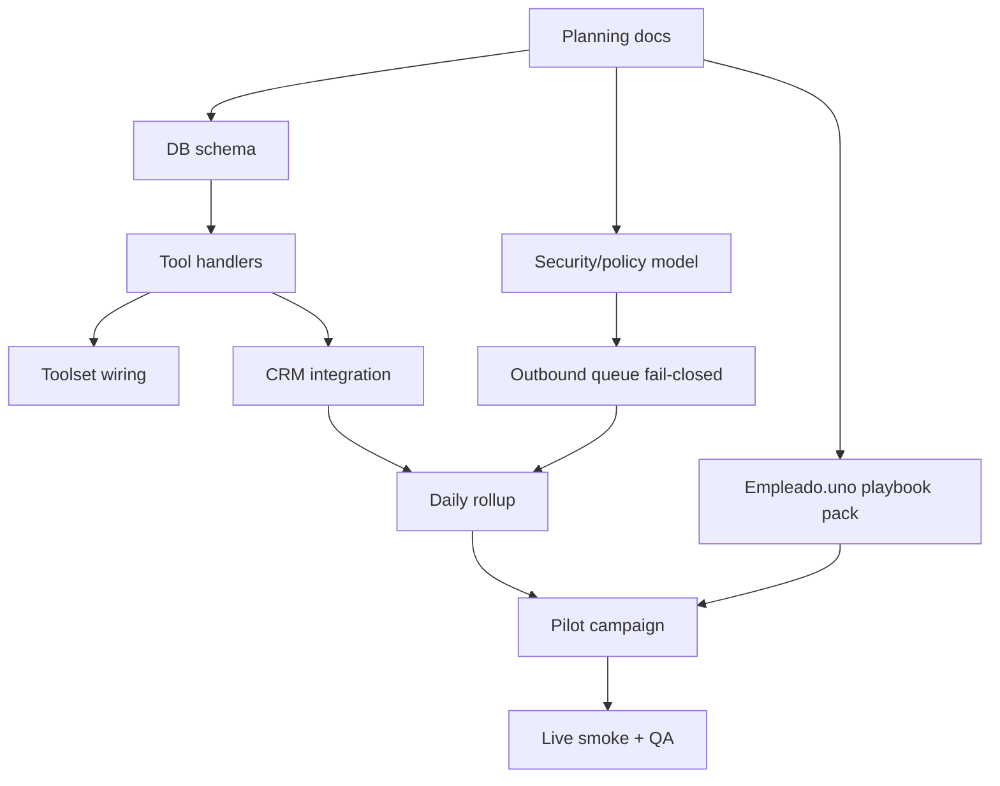

# Task Graph 001 — Sales Operator Core



## Task inventory

| ID | Title | Owner engine | Depends on | Acceptance |
|---|---|---|---|---|
| T0 | Planning gates and docs | Zeus/Factory | none | PRD, ADR, sprint, task graph, QA/security, docs index exist. |
| T1 | DB schema and module registration | Claude/Codex | T0 | Migration creates schema/tables/roles/grants. |
| T2 | Tool handlers and toolset | Claude/Codex | T1 | `sales_operator_*` tools registered and tested. |
| T3 | CRM/Funnel bridge | Claude/Codex | T2 | Approved lead creates/upserts CRM rows and follow-up. |
| T4 | Channel policy + outbound queue | Claude/Codex | T2 | Queue is fail-closed and enforces opt-out/rate limits. |
| T5 | Empleado.uno playbook pack | Zeus/Claude | T0 | Vertical playbooks and templates available. |
| T6 | Cron/daily operator scripts | Claude/Codex | T2,T4,T5 | Dry-run daily rollup works; cron creation documented/gated. |
| T7 | Pilot smoke | Zeus/reviewer | T1-T6 | Campaign+territory+10 leads+rollup verified. |
```
