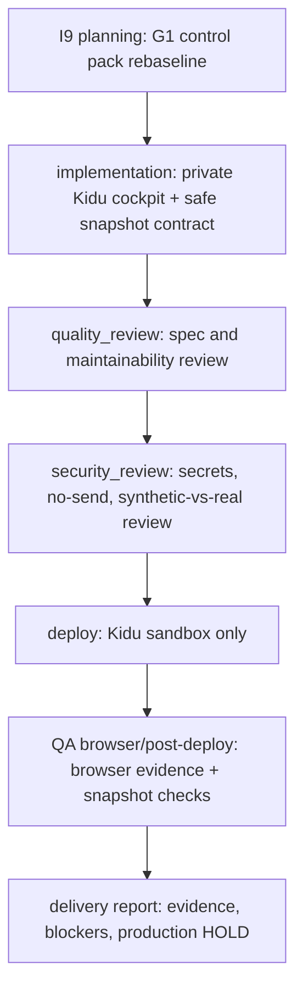

# TASK_GRAPH — Sales Operator Core / Revenue Operator v2

Detailed historical task graph: `website/docs/developer-guide/sales-operator-core/TASK-GRAPH-001.md`.

## I9 mandatory UI delivery graph

## Task inventory

| ID | Phase | Owner | Reviewer | Inputs | Outputs | Verification |
|---|---|---|---|---|---|---|
| I9.0 | planning | implementation-planner | solution-architect | Factory task `empleado-uno-sales-operator-core-i9-g1-rebaseline-revenue-operator-v2-pri`, existing G1 docs, Factory DB status | Updated control pack docs for Revenue Operator v2 private Kidu cockpit | Search/content checks across PRD, ADRS, TECHNICAL_BLUEPRINT, SPRINT_PLAN, TASK_GRAPH, QA_GATES, SECURITY_GATES, TRACKER, DOCUMENTATION_INDEX. |
| I9.1 | implementation | assigned builder | quality-reviewer | I9.0 docs, branch/worktree, safe snapshot contract | Private cockpit UI and safe snapshot/exporter changes | Local tests/build; snapshot validation proves freshness/provenance and no credentials; no external sends. |
| I9.2 | quality_review | quality-reviewer | Zeus/factory-orchestrator | I9.1 diff, tests, docs | Quality review gate with rework list or pass | Confirms scope matches I9, UI labels real/synthetic/freshness clearly, and implementation avoids unrelated refactors. |
| I9.3 | security_review | security-reviewer | Zeus/factory-orchestrator | I9.1/I9.2 evidence, snapshot artifacts, resolved UI behavior | Security review gate | Confirms no credentials/secrets in snapshots, no provider enablement, no browser send path, no auto-send/cold WhatsApp, and synthetic data not shown as real outcomes. |
| I9.4 | deploy | devops-release | qa-verifier | Reviewed build artifact, sandbox contract, Kidu target | Kidu sandbox deployment under authorized path/subdomain | Deployment evidence names host/path/artifact; production remains HOLD. |
| I9.5 | QA browser/post-deploy | qa-verifier | quality-reviewer | Kidu sandbox URL, safe snapshot, QA gates | Browser/post-deploy QA evidence | Browser run validates private cockpit, real/synthetic badges, freshness, policy/no-send panel, no external action controls, and no credential leakage. |
| I9.6 | delivery report | factory-reporter / Zeus | Jean or Zeus as gate owner | Gate evidence, commit, sandbox QA, blockers | Delivery report + Factory evidence | Report includes commit/branch, commands, sandbox URL if any, no-send/production HOLD status, and remaining human decisions. |

## Parallelization and file-conflict notes

- I9.0 touches only project-local control docs and must finish before implementation starts.
- I9.1 can split UI and snapshot work only if builders coordinate files and keep a single snapshot schema owner.
- I9.2 and I9.3 are independent reviews after implementation evidence exists, but security findings can block deploy.
- Deploy and browser/post-deploy QA are serialized because QA must inspect the deployed sandbox artifact.

## Cross-phase acceptance rules

- No task may mark synthetic/test/demo metrics as real outcomes.
- No task may add provider credentials or action secrets to UI data.
- No task may expose a browser control that sends WhatsApp/email/SMS/voice/social messages or invokes external provider actions.
- Every phase must record evidence in Factory DB or final summary with commands, paths, and results.
