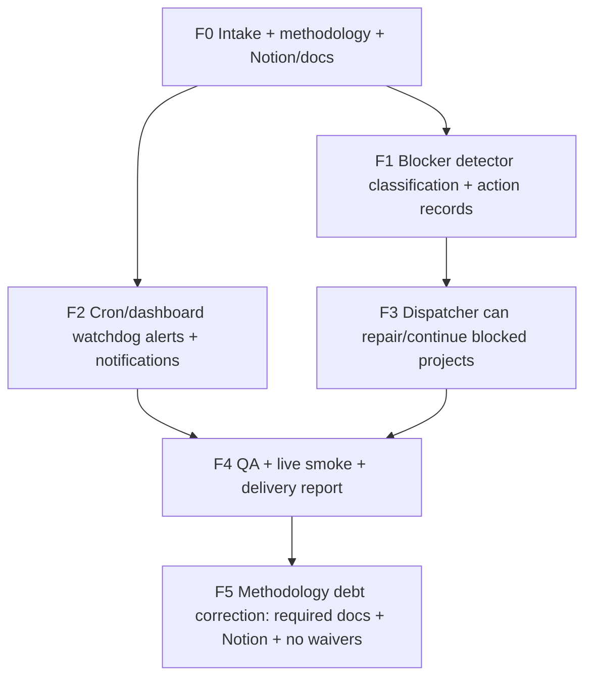

# Task Graph — Factory Runtime Remediation

## Factory DB tasks

| Task ID | Title | Status | Evidence |
|---|---|---|---|
| `factory-runtime-remediation-f0-intake-task-graph-and-remediation-arc` | F0 — Intake, task graph, remediation architecture | done | Project created, lane/task graph, docs started |
| `factory-runtime-remediation-f1-blocker-detector-classifications-and-` | F1 — Blocker detector classifications and actions | done | `factory_pg.py`, `factory_blocker_detector.py`, tests |
| `factory-runtime-remediation-f2-cron-dashboard-watchdog-alerts-and-te` | F2 — Watchdog alerts and notification path | done | alerts in status, cron `factory-watchdog-alerts` |
| `factory-runtime-remediation-f3-dispatcher-acts-on-blocked-projects-s` | F3 — Dispatcher acts on blocked projects | done | claim predicates and force_tick repair/reopen |
| `factory-runtime-remediation-f4-qa-live-smoke-and-delivery-report` | F4 — QA, smoke, report | done | 23/23 tests passed, scripts smoked |
| F5 — Methodology debt correction | Build docs/Notion and remove waivers | in correction | This document set + Notion page |

## Dependency rules

- F1 and F2 require F0.
- F3 requires F1.
- F4 requires F2 and F3.
- F5 is a correction dependency before final accepted/completed state.
