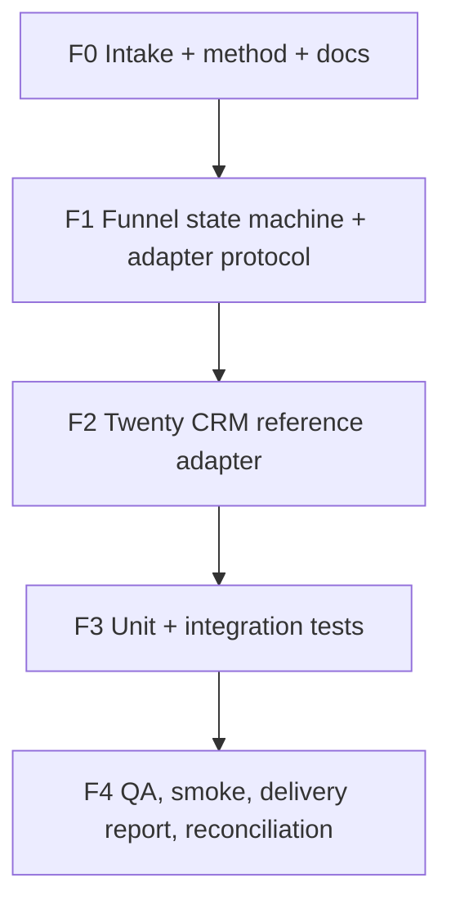

# Task Graph — Funnel Core / CRM Sales Workflow

## Factory DB Tasks

| Task ID | Title | Status | Evidence |
|---------|-------|--------|----------|
| funnel-core-crm-workflow-f0-intake | F0 — Intake, method, task graph | done | factory/projects/funnel-core-crm-workflow/FACTORY_INTAKE.md |
| funnel-core-crm-workflow-f1-funnel-core | F1 — FunnelCore module + adapter protocol | done | branch factory/funnel-core-crm-workflow/inc-001-client-requirement-implement-gen |
| funnel-core-crm-workflow-f2-twenty-adapter | F2 — Twenty CRM reference adapter | done | agent/crm/adapters/twenty.py |
| funnel-core-crm-workflow-f3-tests | F3 — Unit + integration tests | done | tests/agent/crm/ |
| funnel-core-crm-workflow-reconcile-missing-required-docs | R2 — Reconciliation: complete required docs | in_progress | factory/projects/funnel-core-crm-workflow/ |

## Dependencies

- F1 requires F0.
- F2 requires F1.
- F3 requires F2.
- F4 requires F3 + R2 completion.
