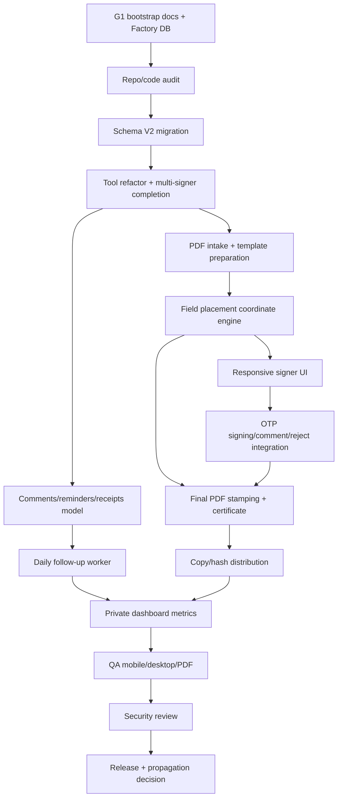

# Task Graph — Signature Core Refactor

Project: zeus-signature-core-refactor-hotfix
Owner: Jean García / SitioUno
Created: 2026-06-12T18:09:47-04:00
Status: G1 bootstrap pack complete; implementation not started
Validated: yes — initial Zeus document consistency pass
Reviewed: yes — initial Zeus Factory orchestrator review; independent quality/security review remains a project task before delivery

## Dependency Graph

## Canonical Task List

| ID | Phase | Owner | Reviewer | Summary | Dependencies | Acceptance |
|---|---|---|---|---|---|---|
| T00 | planning | factory-orchestrator | quality-reviewer | G1 bootstrap docs and DB registration | none | Project/docs/tasks/gates registered and committed |
| T01 | research | solution-architect | quality-reviewer | Audit current signature code, public routes, tests, DB migration state | T00 | Findings mapped to implementation tasks |
| T02 | implementation | claude-builder | codex-builder | Add V2 schema migration for template versions, field placements, values, comments, reminders, receipts, metrics | T01 | Migration runs; grants/indexes/tests pass |
| T03 | implementation | claude-builder | quality-reviewer | Refactor tools and fix multi-signer completion semantics | T02 | Existing handlers compatible; all-required-signers rule tested |
| T04 | implementation | claude-builder | codex-builder | PDF intake/hash/preview/template preparation tools | T03 | Given PDF, tool stores hash/page count/previews/template version |
| T05 | implementation | claude-builder | qa-verifier | Field placement coordinate engine and visual fixture tests | T04 | Coordinate round-trip and stamped fixture visual QA pass |
| T06 | implementation | claude-builder | qa-verifier | Responsive PDF signer UI with overlay fields and signature canvas | T05 | Mobile and desktop browser QA evidence captured |
| T07 | implementation | codex-builder | security-reviewer | OTP action integration for sign/approve/reject/comment/reject reason | T06 | OTP bypass tests fail closed; comments/rejections audited |
| T08 | implementation | codex-builder | quality-reviewer | Comments, reminders, delivery receipts APIs/tools | T03 | DB/tool tests for comments/reminders/receipts pass |
| T09 | implementation | codex-builder | qa-verifier | Daily follow-up worker until completed/expired | T08 | Due reminders generated idempotently and recorded |
| T10 | implementation | claude-builder | qa-verifier | Multi-field PDF stamping and certificate/hash artifacts | T05,T07 | Final PDF places data/signatures and stores hashes/artifacts |
| T11 | implementation | codex-builder | qa-verifier | Final copy/hash distribution to all signers | T10 | Delivery receipts stored for each signer/copy |
| T12 | implementation | claude-builder | qa-verifier | Private `/user/signatures/` dashboard metrics | T09,T11 | Protected dashboard shows live metrics/status |
| T13 | qa | qa-verifier | quality-reviewer | End-to-end QA: PDF, mobile, desktop, DB, reminders | T12 | Real smoke evidence and no critical bugs |
| T14 | security | security-reviewer | factory-orchestrator | Security/privacy review | T13 | Token/OTP/hash/access controls approved or blocked with fixes |
| T15 | delivery | devops-release | factory-orchestrator | Release readiness and runtime propagation decision | T14 | Delivery report, release notes, propagation plan |

## Blocking Policy

- T02+ must not begin until G1 docs are committed and initial planning/architecture gates are recorded.
- UI tasks must not claim mobile readiness without actual mobile viewport/browser evidence.
- Delivery must not pass while final artifacts are local-only, uncommitted, or unverified.
